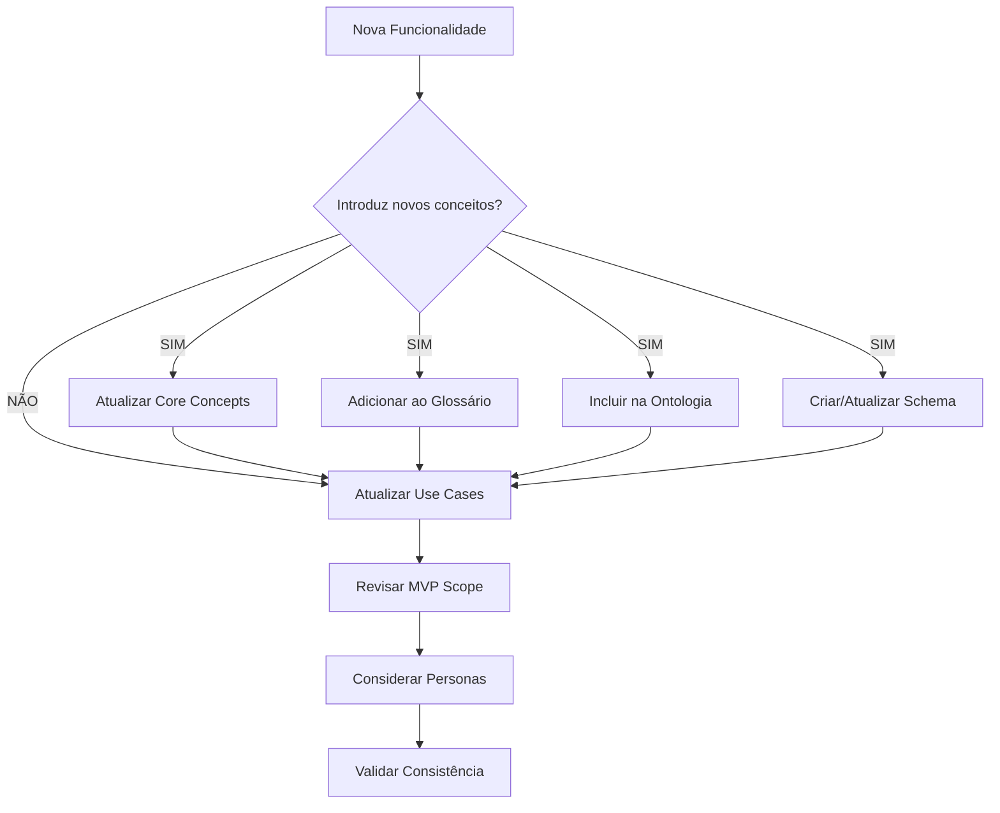
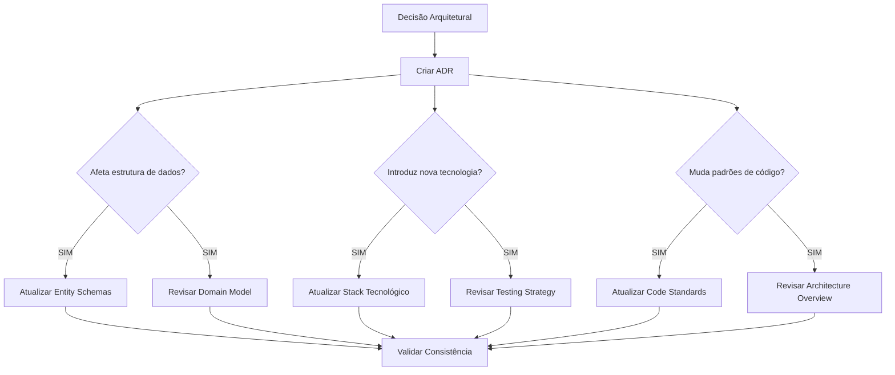
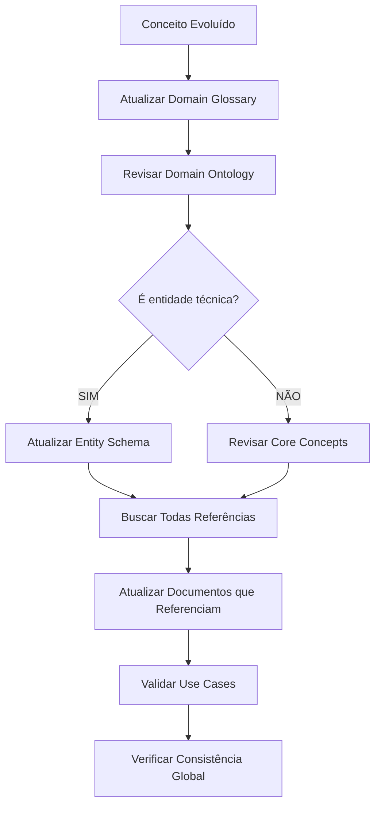
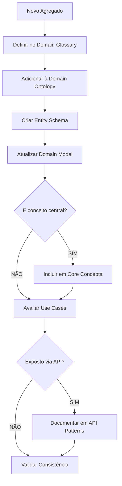
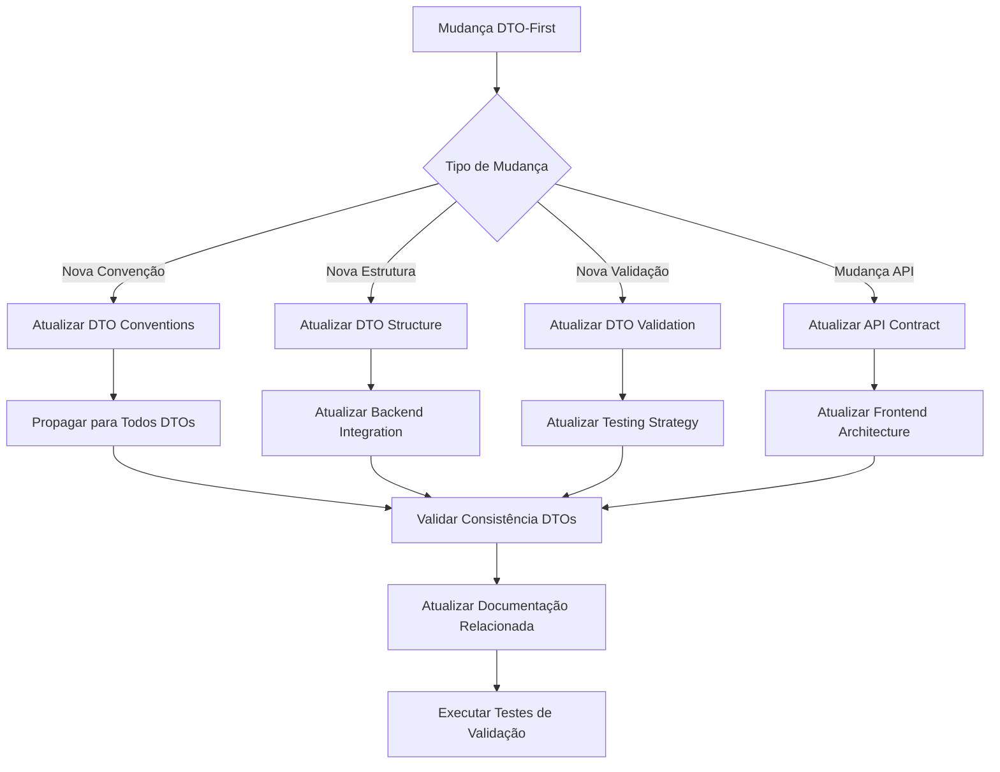

# 🗺️ Matriz de Propagação Semântica - OrçaSonhos

---
**Metadados Estruturados para IA/RAG:**
```yaml
document_type: "propagation_matrix"
domain: "documentation_governance"
audience: ["ai_systems", "technical_writers", "architects"]
complexity: "advanced"
tags: ["propagation", "dependencies", "semantic_mapping", "maintenance", "dto_first"]
related_docs: ["../documentation-maintenance-guide.md", "../domain-ontology.md", "../technical/frontend-architecture/dto-first-principles.md"]
ai_context: "Semantic propagation rules for documentation maintenance with DTO-First Architecture"
last_updated: "2025-01-24"
```
---

## 🎯 Propósito da Matriz

Esta matriz define **regras de propagação semântica** para garantir que mudanças em qualquer parte da documentação OrçaSonhos sejam adequadamente refletidas em todos os documentos relacionados, mantendo consistência conceitual e terminológica.

---

## 📊 Matriz de Dependências Documentais

### **🏢 Business Documents → Technical Documents**

| Mudança em Business | Impacto Técnico | Ação Requerida |
|---------------------|-----------------|----------------|
| **Core Concepts** → Novo conceito | Domain Model, Entity Schemas | Criar representação técnica |
| **Use Cases** → Nova jornada | Architecture Docs, API Patterns | Definir endpoints e fluxos |
| **Personas** → Nova persona | Frontend Architecture, UI System | Adaptar experiência de usuário |
| **MVP Scope** → Mudança escopo | Testing Strategy, Code Standards | Ajustar estratégias de implementação |

### **⚙️ Technical Documents → Business Documents**

| Mudança Técnica | Impacto Business | Ação Requerida |
|-----------------|------------------|----------------|
| **ADR** → Nova decisão | Core Concepts, Use Cases | Validar se afeta conceitos de negócio |
| **Architecture** → Mudança estrutural | MVP Scope, Competitive Analysis | Reavaliar viabilidade e prazos |
| **Code Standards** → Novo padrão | Core Concepts | Verificar se reflete conceitos corretamente |

### **🧠 Semantic Documents → All Documents**

| Mudança Semântica | Impacto Global | Ação Requerida |
|--------------------|----------------|----------------|
| **Domain Ontology** → Nova relação | Todos os docs que referenciam conceitos | Validar consistência terminológica |
| **Domain Glossary** → Nova definição | Todos os docs | Buscar e atualizar uso do termo |
| **Entity Schemas** → Nova entidade | Domain Model, Use Cases, Core Concepts | Integrar nova entidade ao domínio |

### **🏗️ DTO-First Architecture → Technical Documents**

| Mudança DTO-First | Impacto Técnico | Ação Requerida |
|-------------------|-----------------|----------------|
| **DTO Conventions** → Nova convenção | Todos os DTOs, Testes, Componentes | Aplicar convenção em todos os DTOs |
| **DTO Structure** → Nova estrutura | API Patterns, Backend Integration | Sincronizar contratos de API |
| **DTO Validation** → Nova regra | Testing Strategy, Use Cases | Atualizar testes e validações |
| **API Contract** → Mudança contrato | DTOs, Frontend Architecture | Atualizar DTOs correspondentes |

---

## 🔄 Fluxos de Propagação por Tipo de Mudança

### **1️⃣ Nova Funcionalidade de Negócio**



**Checklist Detalhado:**
```yaml
nova_funcionalidade:
  conceitos_novos:
    - action: "Definir no Domain Glossary"
      details: "Nome, definição, sinônimos, exemplos"
      impact: "ALTO"

    - action: "Adicionar à Domain Ontology"
      details: "Taxonomia, relações, hierarquia"
      impact: "ALTO"

    - action: "Atualizar Core Concepts"
      details: "Explicação conceitual para usuários"
      impact: "MÉDIO"

    - action: "Criar Entity Schema"
      details: "Se novo agregado/entidade técnica"
      impact: "ALTO"
      condition: "Se entidade de domínio"

  casos_de_uso:
    - action: "Incluir em Use Cases"
      details: "Novo caso ou extensão de existente"
      impact: "MÉDIO"

    - action: "Revisar Personas"
      details: "Impacto nas jornadas existentes"
      impact: "BAIXO"

  escopo:
    - action: "Validar MVP Scope"
      details: "Confirmar se no escopo atual"
      impact: "MÉDIO"

validacoes:
  - "Terminologia consistente em todos os docs"
  - "Referências cruzadas atualizadas"
  - "Metadados incluindo novas tags"
```

### **2️⃣ Decisão Arquitetural**



**Matriz de Impacto Arquitetural:**
```yaml
decisao_arquitetural:
  obrigatorio:
    - documento: "ADR"
      acao: "Criar novo ADR seguindo template"
      template: "Context → Decision → Consequences"

  condicional:
    mudanca_dados:
      condicao: "Afeta estrutura de entidades"
      documentos: ["Entity Schemas", "Domain Model"]
      acao: "Atualizar definições técnicas"

    nova_tecnologia:
      condicao: "Introduz nova tech/ferramenta"
      documentos: ["Stack Tecnológico", "Testing Strategy"]
      acao: "Documentar adoção e impactos"

    novos_padroes:
      condicao: "Estabelece novos padrões"
      documentos: ["Code Standards", "Architecture Overview"]
      acao: "Formalizar padrões e exemplos"

    impacto_conceitual:
      condicao: "Muda conceitos de domínio"
      documentos: ["Core Concepts", "Domain Ontology"]
      acao: "Sincronizar visão técnica e negócio"
```

### **3️⃣ Evolução de Conceito Existente**



**Processo de Evolução Conceitual:**
```yaml
evolucao_conceito:
  etapas:
    1_definicao:
      documento: "Domain Glossary"
      acao: "Refinar definição principal"
      campos: ["definição", "sinônimos", "exemplos", "relacionamentos"]

    2_taxonomia:
      documento: "Domain Ontology"
      acao: "Ajustar relações e hierarquia"
      campos: ["taxonomia", "relações", "propriedades"]

    3_conceitual:
      documento: "Core Concepts"
      acao: "Alinhar explicação para usuários"
      foco: "Linguagem acessível, exemplos práticos"

    4_tecnico:
      documento: "Entity Schemas"
      condicao: "Se conceito é entidade técnica"
      acao: "Sincronizar estrutura e regras"

    5_propagacao:
      acao: "Buscar todas as referências"
      metodo: "grep -r 'conceito' todos_os_docs"
      resultado: "Lista de documentos para atualizar"

    6_validacao:
      acao: "Verificar consistência global"
      checklist: ["terminologia", "sinônimos", "exemplos", "relações"]

  impactos:
    alto: ["Domain Glossary", "Domain Ontology"]
    medio: ["Core Concepts", "Entity Schemas", "Use Cases"]
    baixo: ["Documentos que apenas mencionam"]
```

### **4️⃣ Novo Agregado/Entidade de Domínio**



### **5️⃣ Mudança DTO-First Architecture**



**Template Novo Agregado:**
```yaml
novo_agregado:
  definicao_semantica:
    glossario:
      - nome: "[Nome do Agregado]"
      - definicao: "[O que é e para que serve]"
      - sinonimos: ["termo1", "termo2"]
      - exemplos: ["exemplo1", "exemplo2"]
      - relacionamentos: ["relaciona-se com X", "contém Y"]

    ontologia:
      - taxonomia: "Onde se encaixa na hierarquia"
      - relacoes: ["CONTAINS", "BELONGS_TO", "RELATES_TO"]
      - propriedades: ["prop1", "prop2"]

  estrutura_tecnica:
    schema:
      - tipo: "aggregate_root | entity | value_object"
      - propriedades: "Definição completa"
      - relacionamentos: "Foreign keys e associações"
      - regras_negocio: "Invariantes e validações"

  integracao_dominio:
    core_concepts:
      condicao: "Se conceito central para usuários"
      acao: "Explicar em linguagem acessível"

    use_cases:
      acao: "Identificar casos de uso que envolvem"
      considerar: "Criação, leitura, atualização, remoção"

    api_patterns:
      condicao: "Se exposto via API"
      acao: "Documentar endpoints e padrões"
```

---

## 🎯 Regras de Propagação por Documento

### **📚 Domain Glossary**

**Quando atualizar:**
- Novo termo introduzido em qualquer documento
- Definição de conceito existente evolui
- Sinônimos identificados em uso real
- Relacionamentos entre conceitos mudam

**Propagação automática para:**
- `Domain Ontology` → Sincronizar relações
- `Core Concepts` → Alinhar definições conceituais
- Todos os docs → Validar uso consistente do termo

### **🧠 Domain Ontology**

**Quando atualizar:**
- Nova entidade ou agregado identificado
- Relacionamentos entre conceitos evoluem
- Taxonomia de domínio se altera
- Regras de negócio fundamentais mudam

**Propagação automática para:**
- `Entity Schemas` → Estruturas técnicas
- `Domain Glossary` → Definições textuais
- `Core Concepts` → Explicações conceituais
- `Use Cases` → Validar casos ainda fazem sentido

### **📊 Entity Schemas**

**Quando atualizar:**
- Nova entidade de domínio criada
- Propriedades de entidades evoluem
- Relacionamentos técnicos mudam
- Regras de validação são adicionadas

**Propagação automática para:**
- `Domain Model` → Implementação técnica
- `API Patterns` → Se entidade exposta via API
- `Core Concepts` → Se mudança conceitual
- `Testing Strategy` → Novos cenários de teste

### **💡 Core Concepts**

**Quando atualizar:**
- Conceito central para usuários muda
- Nova funcionalidade introduz conceito importante
- Explicação conceitual precisa ser refinada
- Exemplos práticos precisam ser atualizados

**Propagação automática para:**
- `Use Cases` → Casos de uso podem mudar
- `Personas` → Jornadas podem ser afetadas
- `MVP Scope` → Escopo pode precisar ajuste
- `Onboarding Strategy` → Estratégia de onboarding

---

## 🔍 Matriz de Validação Cruzada

### **Consistência Semântica**

| Documento A | Documento B | Validação Requerida |
|-------------|-------------|---------------------|
| **Domain Glossary** | **Domain Ontology** | Todo conceito na ontologia tem definição no glossário |
| **Domain Ontology** | **Entity Schemas** | Entidades técnicas refletem conceitos semânticos |
| **Entity Schemas** | **Core Concepts** | Estruturas técnicas alinham com conceitos de negócio |
| **Core Concepts** | **Use Cases** | Casos de uso usam conceitos corretamente |
| **Use Cases** | **Personas** | Jornadas refletem casos de uso documentados |

### **Integridade Referencial**

```yaml
validacao_referencias:
  links_internos:
    origem: "Qualquer documento"
    destino: "Outro documento do projeto"
    validacao: "Link funciona e target existe"
    frequencia: "A cada atualização"

  conceitos_referenciados:
    origem: "Qualquer documento técnico ou business"
    destino: "Domain Glossary"
    validacao: "Conceito mencionado está definido"
    acao_se_nao: "Adicionar definição ao glossário"

  entidades_mencionadas:
    origem: "Core Concepts, Use Cases"
    destino: "Entity Schemas, Domain Ontology"
    validacao: "Entidade existe formalmente"
    acao_se_nao: "Criar definição formal"

  casos_uso_personas:
    origem: "Personas (jornadas)"
    destino: "Use Cases"
    validacao: "Jornada tem caso de uso correspondente"
    acao_se_nao: "Documentar caso de uso"
```

---

## 🚨 Alertas de Inconsistência

### **Sinais de Alerta Semântico**

#### **🔴 Crítico - Ação Imediata**
- Conceito usado sem definição no glossário
- Entidade referenciada sem schema formal
- Link interno quebrado em documento principal
- Terminologia inconsistente entre business e technical

#### **🟡 Atenção - Revisar Soon**
- Documento desatualizado há mais de 30 dias
- Conceito definido mas não usado em lugar nenhum
- Schema técnico sem correspondente conceitual
- Use case que não mapeia para persona

#### **🟢 Informativo - Monitorar**
- Novo termo sendo usado informalmente
- Padrão emergindo mas não formalizado
- Feedback indicando confusão conceitual
- Oportunidade de melhoria identificada

### **Processo de Resolução de Inconsistências**

```yaml
resolucao_inconsistencias:
  critico:
    tempo_resposta: "24 horas"
    processo:
      1: "Identificar root cause da inconsistência"
      2: "Aplicar matriz de propagação relevante"
      3: "Atualizar documentos necessários"
      4: "Validar consistência global"
      5: "Atualizar metadados afetados"

  atencao:
    tempo_resposta: "1 semana"
    processo:
      1: "Avaliar impacto da inconsistência"
      2: "Priorizar baseado em uso/importância"
      3: "Aplicar correções seguindo padrões"
      4: "Documentar lição aprendida"

  informativo:
    tempo_resposta: "1 mês"
    processo:
      1: "Analisar tendência/padrão emergente"
      2: "Decidir se deve ser formalizado"
      3: "Se sim, seguir processo normal de adição"
      4: "Se não, documentar decisão"
```

---

## 📋 Checklists de Propagação

### **✅ Nova Funcionalidade**
```markdown
- [ ] Identifica conceitos novos introduzidos?
  - [ ] Adicionar ao Domain Glossary (definição, sinônimos, exemplos)
  - [ ] Incluir na Domain Ontology (taxonomia, relações)
  - [ ] Atualizar Core Concepts se conceito central

- [ ] Funcionalidade afeta casos de uso?
  - [ ] Criar novo caso de uso ou atualizar existente
  - [ ] Verificar impacto nas personas/jornadas

- [ ] Mudança está no escopo atual?
  - [ ] Validar MVP Scope
  - [ ] Considerar impacto no roadmap

- [ ] Consistência garantida?
  - [ ] Terminologia alinhada em todos os docs
  - [ ] Referências cruzadas atualizadas
  - [ ] Metadados incluem novas tags
```

### **✅ Decisão Arquitetural**
```markdown
- [ ] ADR criado seguindo template?
  - [ ] Contexto claramente definido
  - [ ] Decisão e justificativa explícitas
  - [ ] Consequências (positivas e negativas) listadas
  - [ ] Alternativas consideradas documentadas

- [ ] Impactos técnicos identificados?
  - [ ] Atualizar Architecture Overview se mudança estrutural
  - [ ] Revisar Stack Tecnológico se nova ferramenta
  - [ ] Atualizar Entity Schemas se afeta dados
  - [ ] Revisar Code Standards se novos padrões

- [ ] Impactos conceituais avaliados?
  - [ ] Verificar se afeta Core Concepts
  - [ ] Validar se Use Cases ainda fazem sentido
  - [ ] Considerar impacto em Personas
```

### **✅ Evolução de Conceito**
```markdown
- [ ] Definição refinada no Domain Glossary?
  - [ ] Nova definição é mais clara/precisa
  - [ ] Sinônimos ainda são válidos
  - [ ] Exemplos refletem nova definição
  - [ ] Relacionamentos atualizados

- [ ] Ontologia sincronizada?
  - [ ] Relações semânticas ajustadas
  - [ ] Taxonomia reflete evolução
  - [ ] Propriedades atualizadas

- [ ] Propagação completada?
  - [ ] Todos documentos que referenciam atualizados
  - [ ] Core Concepts alinhado com nova definição
  - [ ] Entity Schemas sincronizados se aplicável
  - [ ] Use Cases validados com nova definição
```

### **✅ Mudança DTO-First Architecture**
```markdown
- [ ] Tipo de mudança identificado?
  - [ ] Nova convenção de DTO
  - [ ] Mudança na estrutura de DTO
  - [ ] Nova regra de validação
  - [ ] Mudança no contrato de API

- [ ] Documentos DTO-First atualizados?
  - [ ] DTO Conventions atualizado
  - [ ] DTO-First Principles revisado
  - [ ] Backend Integration sincronizado
  - [ ] Testing Strategy ajustado

- [ ] Propagação para DTOs existentes?
  - [ ] Todos DTOs seguem nova convenção
  - [ ] Estruturas de DTO atualizadas
  - [ ] Validações aplicadas consistentemente
  - [ ] Contratos de API alinhados

- [ ] Documentação técnica atualizada?
  - [ ] Frontend Architecture revisado
  - [ ] Code Standards atualizados
  - [ ] Exemplos de código atualizados
  - [ ] Testes de validação executados
```

---

## 📊 Métricas de Qualidade da Propagação

### **Indicadores de Sucesso**

```yaml
metricas_propagacao:
  consistencia_terminologica:
    medida: "% de termos com definição consistente"
    target: ">= 95%"
    fonte: "Comparação Glossário vs Uso Real"

  integridade_referencial:
    medida: "% de links internos funcionais"
    target: "100%"
    fonte: "Scripts de validação"

  cobertura_conceitual:
    medida: "% de conceitos com representação completa"
    target: ">= 90%"
    definicao: "Conceito tem: glossário + ontologia + uso"

  tempo_propagacao:
    medida: "Tempo médio para propagar mudança"
    target: "<= 24h para crítico, <= 1 semana para médio"

  qualidade_metadados:
    medida: "% de documentos com metadados válidos"
    target: "100%"
    fonte: "Scripts de validação"
```

### **Dashboard de Saúde Semântica**

```markdown
## Status Atual da Propagação Semântica

### 🎯 Consistência Global: 94% ✅
- Domain Glossary ↔ Domain Ontology: 98% ✅
- Entity Schemas ↔ Domain Concepts: 92% ✅
- Links Internos Funcionais: 97% ✅

### 📊 Cobertura Conceitual: 89% ⚠️
- Conceitos com definição completa: 89%
- Ação requerida: 3 conceitos precisam de schema técnico

### ⏱️ Performance de Propagação: ✅
- Última mudança crítica: Propagada em 18h
- Backlog de mudanças médias: 2 itens
- SLA atendido: 95% dos casos

### 🔧 Ações Recomendadas:
1. Criar schemas técnicos para: [conceito1, conceito2, conceito3]
2. Revisar 5 links internos quebrados identificados
3. Atualizar metadados de 3 documentos desatualizados
```

---

## 🔄 Evolução da Matriz

### **Como Esta Matriz Evolui**

Esta matriz é um **documento vivo** que deve ser atualizada quando:

1. **Novos padrões de propagação** são identificados
2. **Novos tipos de documentos** são adicionados
3. **Relacionamentos** entre documentos mudam
4. **Feedback** indica regras inadequadas ou faltantes

### **Processo de Evolução**

```yaml
evolucao_matriz:
  identificacao:
    fontes: ["Feedback de uso", "Análise de inconsistências", "Novos tipos de mudança"]

  analise:
    questoes: ["Padrão é recorrente?", "Afeta múltiplos documentos?", "Causa confusão?"]

  formalizacao:
    processo: ["Documentar novo padrão", "Adicionar à matriz", "Criar checklist", "Testar"]

  validacao:
    metodo: "Aplicar em casos reais e medir eficácia"
    ajuste: "Refinar baseado em resultados"
```

---

## 🤖 Instruções Específicas para IA

### **Como Usar Esta Matriz**

1. **Para cada mudança**, identifique o tipo na seção correspondente
2. **Aplique o fluxo de propagação** específico
3. **Execute o checklist** correspondente
4. **Valide a consistência** usando as regras de validação cruzada
5. **Monitore métricas** para garantir qualidade

### **Priorização de Ações**

```yaml
prioridades:
  P0_critico:
    - Inconsistências semânticas (terminologia)
    - Links quebrados em documentos principais
    - Conceitos sem definição sendo usados

  P1_alto:
    - Propagação de funcionalidades novas
    - Sincronização após ADRs importantes
    - Evolução de conceitos centrais

  P2_medio:
    - Atualização de metadados
    - Refinamento de exemplos
    - Melhorias de clareza

  P3_baixo:
    - Otimizações de estrutura
    - Padronização de formato
    - Melhorias incrementais
```

### **Regra de Ouro**

**Sempre que alterar um documento, pergunte**: "Que outros documentos podem ser afetados por esta mudança?" Consulte esta matriz para garantir propagação completa e consistente.